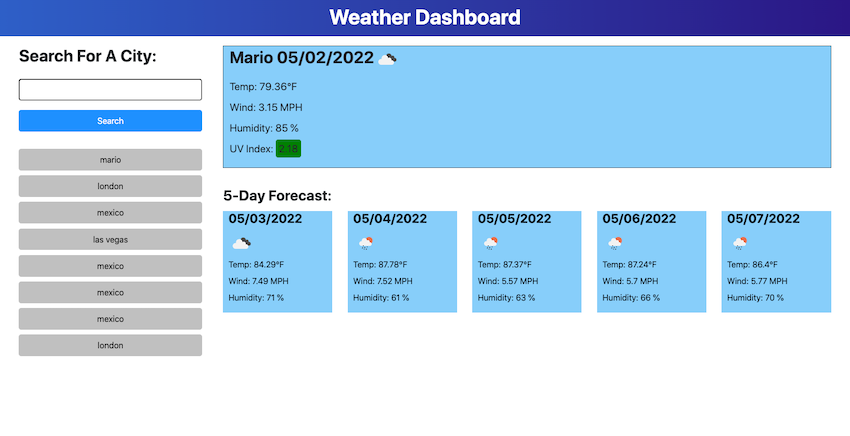

# **Weather Dashboard**

## Description
This is Web App to search the weather on a given city, it fetch an open API from Open Weather Map to retrive the weather and a forecast of 5 day wather in the same city, it also save the last searchs and yoy can use them to re seach the same cities. It was developed in JAVASCRIPT, HTML and CSS.

   
## Table of Contents
* [Description](#description)
* [Motivation](#motivation)
* [Usage](#usage)
  
    ## License 
    This project is license under the "https://opensource.org/licenses/MIT"
* [Installation](#installation)
* [Tests](#tests)
* [Contact](#contact)

## Description
    This Web App fetch an open API from Open Weather to retrive weather from a specific city the visitor enter, it alt also 

## Motivation
    It will help the visitor to review the weather on the last city searched, it store on the local host the last 12 search the visitor did

## Usage
    To check the weather on any city and the 5 days forecast, it also store at local storage the last city found. You neet to create an account in https://openweathermap.org/ to have your API KEY and use it on all the requests you fetch.
    

## License
    MIT

## Installation
    Create the proper directories for css and script and the index.html

## Test
    on any browser open the index.html

## Autor
    For any question or inquiery
* GitHub: [mariopatino](https://github.com/mariopatino)

    